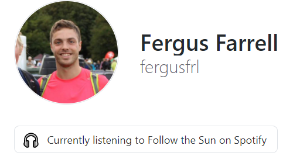

<br />

# Github Live Status: Spotify currently playing

Dynamically update your Github profile status with you Spotify currently playing item.

<br />

## Built With
- [Firebase](https://firebase.google.com/)
- [Google Cloud Platform](https://cloud.google.com/)
- [Spotify Web API](https://developer.spotify.com/documentation/web-api/)
- [Github Profile Status](https://www.npmjs.com/package/github-profile-status)

<br />

## Getting Started
Build and deploy using your own Spotify and Github credentials.

### Prerequisites
- npm
- Firebase Project
- Spotify Web API Refresh Token
- Github API Key

### Installation
- Install Dependencies
  ```
  $ cd ./functions
  $ npm install
  ```
- Update `.firebaserc` with your firebase project id

### Environment Variables
- Spotify Refresh Token
  ```
  $ firebase functions:config:set spotify.refresh_token=<SPOTIFY_REFRESH_TOKEN>
  ```
- Spotify Combined Credentials Base64 Encoded
  ```
  $ firebase functions:config:set spotify.base64_creds=<BASE64(SPOTIFY_CLIENT_ID:SPOTIFY_CLIENT_SECRET)>
  ```
- Github API key
  ```
  $ firebase functions:config:set github.user_access_token=<GITHUB_API_KEY>
  ```

### Deploy
- Deploy to firebase
  ```
  $ firebase deploy
  ```
